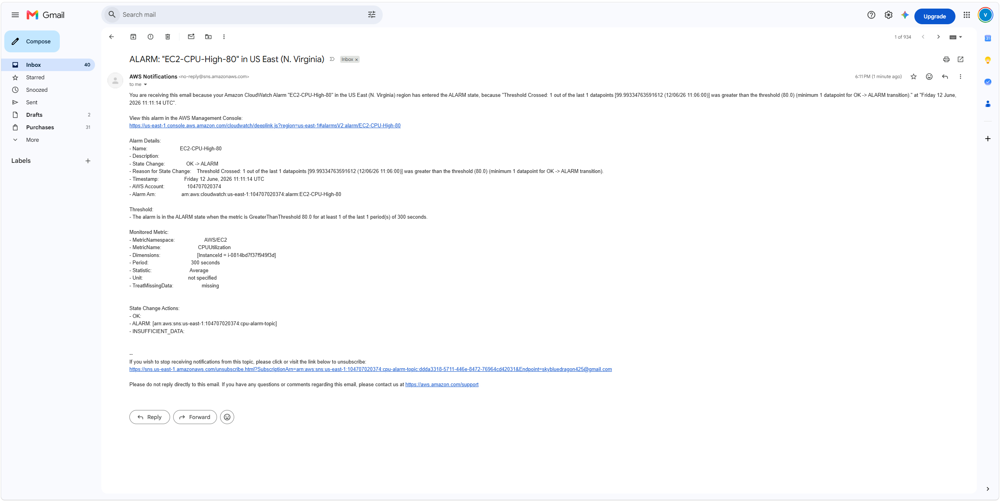

# Lab: CPU Alarm → Email Alert via SNS

## Mục tiêu

Tạo CloudWatch Alarm để gửi email cảnh báo khi CPU của EC2 vượt quá ngưỡng cấu hình.

Điều kiện cảnh báo:

```text
CPUUtilization > 80%
```

---

## Môi trường

| Thành phần     | Thông tin            |
| -------------- | -------------------- |
| Cloud Provider | AWS                  |
| Services       | EC2, CloudWatch, SNS |
| Region         | us-east-1            |
| Metric         | CPUUtilization       |
| Notification   | Email via SNS        |

---

## Bước 1: Tạo SNS Topic và Email Subscription

Tạo SNS Topic để nhận thông báo từ CloudWatch Alarm.

Sau đó tạo Email Subscription và xác nhận email.


---

## Bước 2: Tạo CloudWatch Alarm

Tạo CloudWatch Alarm để theo dõi metric CPU của EC2.

Metric sử dụng:

```text
CPUUtilization
```

Điều kiện:

```text
Greater than 80%
```


---

## Bước 3: Kiểm tra Alarm đã được tạo

Sau khi tạo xong, alarm xuất hiện trong danh sách CloudWatch Alarms.


---

## Bước 4: Kiểm tra Email Alert

Khi alarm được kích hoạt, SNS sẽ gửi email cảnh báo đến địa chỉ đã đăng ký.



---

## Kết quả

Lab đã hoàn thành.

CloudWatch Alarm đã được tạo thành công và có thể gửi cảnh báo qua email bằng Amazon SNS khi CPU của EC2 vượt quá ngưỡng cấu hình.

---

## Kết luận

CloudWatch Alarm kết hợp với SNS giúp giám sát EC2 và tự động gửi thông báo khi hệ thống gặp tình trạng vượt ngưỡng.
